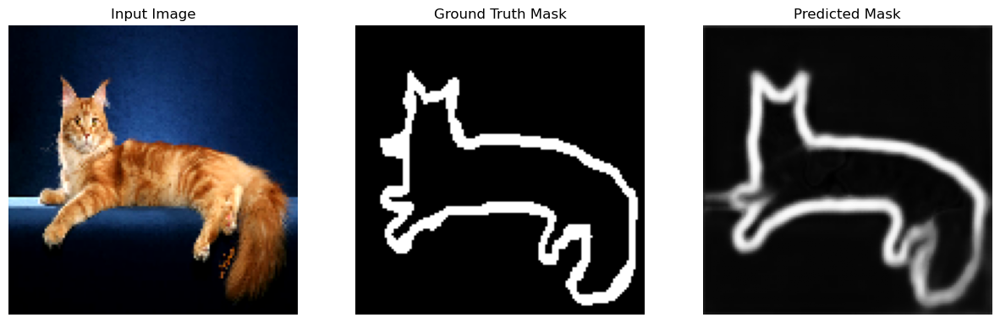

# UNet Model Implementation

## 1. Implementation of UNet Model
This project implements a UNet model for image segmentation tasks. The UNet architecture is widely used for biomedical image segmentation and other image processing tasks due to its ability to capture context and precise localization.

## 2. General Overview of the Project
This UNet implementation supports training and testing on custom datasets and is structured into distinct modules for clarity and scalability:

- **Configs**: Configuration files for managing hyperparameters, dataset paths, and training settings.
- **Data**: Handles loading and preprocessing datasets.
- **Models**: Contains the architecture definition for the UNet model.
- **Utils**: Includes utility functions for training, saving models, and other helper functions.
- **Outputs**: Directory for saving model checkpoints and results.
- **Tests**: Includes testing scripts to evaluate the trained models.

## 3. Project Structure
The project is organized as follows:

    U_Net_Architecture/
    ├── config/                     # Configuration files
    │   └── config.yaml             # Configuration settings for training and testing
    ├── src/                        # Source code directory
    │   ├── data/                   # Data loading and preprocessing scripts
    │   ├── Helpers                 # Helper classes for convoluational blocks
    │   ├── model/                  # UNet model architecture and training scripts
    │   ├── tests/                  # Testing scripts
    │   │   ├── test.py             # Script for testing the trained model
    │   │   └── results/            # Directory for saving test results
    │   └── utils/                  # Utility functions for training and testing
    ├── .gitignore                  # Git ignore file
    ├── main.py                     # Main script for training and testing
    ├── output.png                  # Sample segmentation result
    ├── README.md                   # Project documentation
    ├── requirements.txt            # Required packages for the project
    └── UNet_Architecture.ipynb     # Jupyter notebook for data visualization, training and testing
    
## 4. Results
Generated segmentation results for the custom dataset. Below are examples showcasing the outputs of the UNet model during and after training.

### Example:
A sample image showcasing the segmentation results:



## 5. Training Details
- **Dataset**: The implementation supports custom datasets. The dataset should be organized in a specific structure for training and testing.
- **Hyperparameters**: The training configuration (e.g., learning rates, batch size) is specified in `config/config.yaml`.
- **Output**: Trained models and generated samples are saved in the `outputs/` directory.

## 6. Usage

### Prerequisites
- Python 3.x
- PyTorch
- Torchvision
- PyYAML
- Matplotlib
- NumPy


### Installation
1. Clone the repository:
   ```bash
   git clone https://github.com/ajammoussi/U_Net_Architecture_PyTorch.git
   cd UU_Net_Architecture_PyTorch
    ```
2. Install the required packages:
    ```bash
   pip install -r requirements.txt
   ```
### Training & Testing
To train and test the UNet model, run the following command:
   ```bash
   python train.py
   ```

### References
UNet: Convolutional Networks for Biomedical Image Segmentation by Olaf Ronneberger, Philipp Fischer, and Thomas Brox.
